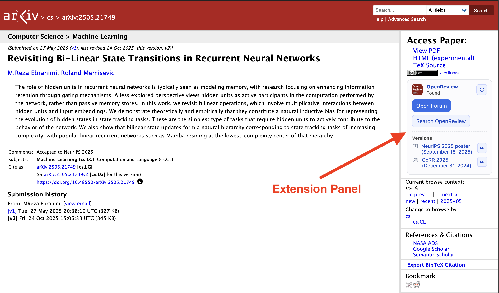

<!-- # arXiv -> OpenReview Linker -->
#  arXiv → OpenReview

A Chrome extension that adds a compact OpenReview panel directly to arXiv abstract pages, so you can jump from a paper to its OpenReview forum in one click.

**Why this extension:**

When reading papers on arXiv, ML researchers often need to check OpenReview to:

- See which conference the paper was submitted to or accepted at
- Read the discussion and reviews
- Grab the official proceedings BibTeX

Finding the matching OpenReview page is usually a manual, repetitive search.

This extension automates that lookup and surfaces the result right next to the arXiv metadata, making it easier to move between the paper and its discussion.

## Features

- Finds matching OpenReview forums from arXiv abstract pages.
- Lists discovered OpenReview versions/venues.
- Copies BibTeX from OpenReview with one click
- Uses local caching for faster repeat lookups

## How it works

1. Extract paper title and arXiv ID from the current arXiv abstract page.
2. Query the public OpenReview API for forum notes by title.
3. Match exact normalized title to get the forum ID.
4. Build versions/venue labels from OpenReview note metadata.
5. Return links to the panel/popup and cache the result locally.
6. On demand, fetch BibTeX from API metadata (or generate it from note fields).

## Installation (Developer Mode)

1. Clone or download this repository.
2. Open `chrome://extensions`.
3. Enable `Developer mode`.
4. Click `Load unpacked`.
5. Select this project folder.
6. Open any arXiv abstract page and use the injected panel or toolbar popup.

## Usage

1. Go to an arXiv paper page like:
- `https://arxiv.org/abs/xxxx.xxxxx`
- `https://arxiv.org/pdf/xxxx.xxxxx.pdf`
- `https://arxiv.org/html/xxxx.xxxxx`
2. Wait for the `OpenReview` box to appear in the right column.
3. Click `Open Forum` to open the matched forum.
4. Use the versions list to open specific versions.
5. Click the quote icon to copy BibTeX.
6. Use the refresh button to force a fresh lookup.

## Permissions explained

- `storage`: cache lookup/BibTeX results locally
- `tabs`: read the active tab URL/context for popup behavior
- Host permissions:
- `https://arxiv.org/*`
- `https://openreview.net/*`
- `https://api.openreview.net/*`
- `https://api2.openreview.net/*`

## Privacy

- No backend server is used by this project.
- Data is stored locally in `chrome.storage.local` for caching.
- No analytics or tracking code is included in this repository.

## Known limitations

- Matching is title-based; if OpenReview title metadata differs significantly, lookup may fail.
- Only public OpenReview entries are discoverable through unauthenticated API requests.
- API availability/network restrictions can temporarily impact lookups.

## Project structure

- `manifest.json`: extension manifest (MV3)
- `content.js`, `content.css`: injected arXiv panel UI/logic
- `background.js`: API lookup, caching, BibTeX fetch/generation
- `popup.html`, `popup.js`, `popup.css`: toolbar popup UI/logic
- `icons/`: extension icon assets

## Development notes

- No build step is required (plain JavaScript/CSS).
- After code changes, reload the extension in `chrome://extensions`.
- If behavior seems stale, refresh the arXiv page after reloading the extension.

## Contributing

Issues and pull requests are welcome.
Please include:

- clear reproduction steps
- expected vs actual behavior
- browser version
- example arXiv URL(s), when relevant

## License

MIT. See `/Users/reza/Projects/arxiv-openreview-extension/LICENSE`.
